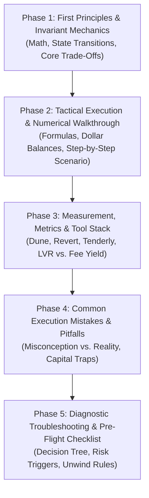

# DeFi Article Writer & Editorial Standard (The LearningSEO Architecture)

This skill codifies the complete editorial, architectural, visual, and quality assurance framework for **LiquidityPools.app**. Directly adapted from the pedagogical gold standard of [LearningSEO.io](https://learningseo.io/) (created by Aleyda Solis), this skill enforces that all educational guides, protocol deep dives, quantitative risk papers, and tutorials read like rigorous financial engineering and market microstructure research—**not generic marketing copy or superficial introductory blogs**.

---

## 1. The LearningSEO Pedagogical Framework

Every guide produced on LiquidityPools.app must follow a predictable, cognitively progressive 5-phase structure:



### 1.1 The 5 Pedagogical Phases
1. **Phase 1: First Principles & Invariant Mechanics**:
   - Open immediately with the fundamental constraint or market dilemma (zero throat-clearing).
   - Formulate the governing mathematical invariant ($x \cdot y = k$, $L = \sqrt{xy}$, DLMM bin math, or dynamic curve amplification $A$).
   - Diagram the state transitions and contract architecture via a custom 3D isometric figure.
2. **Phase 2: Tactical Execution & Numerical Walkthrough**:
   - Walk through an end-to-end capital deployment using realistic market numbers.
   - Specify exact token pairs, fee tiers, tick bounds, and dollar amounts.
   - Quantify entry capital, fee capture rate, impermanent divergence loss, and rebalancing friction.
3. **Phase 3: Measurement, Metrics & Required Tool Stack**:
   - Detail the exact onchain monitoring infrastructure needed to evaluate performance:
     - [Revert Finance](https://revert.finance) for net PnL, fee accrual vs. divergence loss, and HODL benchmarking.
     - [Dune Analytics](https://dune.com) for tick depth distribution, toxic volume ratios, and historical LVR.
     - [DeFiLlama](https://defillama.com) for TVL stability and fee-to-TVL capital efficiency.
     - [EigenPhi](https://eigenphi.io) for MEV sandwich extraction and toxic arbitrage monitoring.
     - [Tenderly](https://tenderly.co) / [Foundry](https://getfoundry.sh) for transaction simulation and hook profiling.
4. **Phase 4: Common Execution Mistakes & Misconceptions Analysis**:
   - Inspired by LearningSEO's famous "Common Execution Mistakes To Avoid" pillar.
   - Break down the 3–5 most lethal assumptions made by retail LPs in a high-density Markdown comparison table.
5. **Phase 5: Diagnostic Troubleshooting & Pre-Flight Checklist**:
   - Modeled after LearningSEO's "Why my page doesn't rank" diagnostic checklist.
   - Provide a step-by-step diagnostic decision tree (*"If fee yield < projected, check toxic flow ratio; if capital exits range, evaluate whether volatility $\sigma$ is permanent or mean-reverting"*).
   - Conclude with an operational pre-flight risk checklist.

---

## 2. Anti-AI Tone & De-Fluff Directives

Modern LLMs default to bland, sycophantic, and rhetorical writing styles that erode authority. You must aggressively enforce these stylistic rules:

1. **Practitioner-First Openings (No Throat-Clearing)**:
   - **Banned**: "In the ever-evolving, fast-paced world of decentralized finance...", "Liquidity pools are the beating heart of DeFi...", "Have you ever wondered how decentralized exchanges work?"
   - **Required**: Open directly with the core trade-off, mathematical problem, or operational dilemma. (e.g., *"Automated market makers that concentrate liquidity into discrete price intervals force liquidity providers to trade off fee yield against localized adverse selection and Loss-Versus-Rebalancing (LVR)."*)
2. **Zero Promotional Fluff & Banned Phrases**:
   - The automated content audit script (`scripts/content-audit.mjs`) strictly halts on:
     - `in the ever-evolving world`
     - `revolutionary`
     - `game-changer`
     - `unlock the`
     - `delve into`
   - In addition, eliminate: `tapestry`, `beacon`, `vital cog`, `testament to`, `landscape`, `paradigm shift`, `skyrocket`, `secret sauce`.
3. **Desk Field Notes (Expert Callouts)**:
   - Directly mirroring the specialist quotes on LearningSEO.io, embed at least one **Author Field Note** formatted as a GitHub Alert:
     ```markdown
     > [!TIP]
     > **Desk Field Note from [Author Name]**:
     > *"[First-hand practitioner insight on why naive models fail in production, unwritten battlefield reality of onchain market making]."*
     ```
4. **Mathematical Rigor**:
   - Invariants and equations must be explicitly stated with parameter definitions, boundary conditions, and real units ($x \cdot y = k$, $L = \sqrt{x \cdot y}$, $P = \frac{y}{x}$, or $(x + \frac{L}{\sqrt{p_b}})(y + L\sqrt{p_a}) = L^2$).

---

## 3. The 5 Verified Author Personas & Domain Routing

Every article must be explicitly attributed in its frontmatter to one of the 5 verified subject-matter experts defined in [`src/lib/authors.ts`](file:///Users/orion/orca/workspaces/LiquidityPool/escolar/src/lib/authors.ts). Never invent unverified author names.

| Author Name | Role & Credentials | Primary Subject Domains | Typical Voice & Perspective |
| :--- | :--- | :--- | :--- |
| **Dr. Elena Rostova** | Head of Quantitative Research & AMM Invariants<br>*(PhD Financial Math, Columbia; Ex-Options MM)* | Concentrated liquidity math, AMM invariants, LVR modeling, discrete bin pricing (DLMM), dynamic fee models, options replication, delta-hedging. | Highly quantitative, mathematical, focused on stochastic calculus, fee volatility trade-offs, and delta profiles. |
| **Marcus Vance** | Senior Market Microstructure & MEV Analyst<br>*(DeFi Microstructure Researcher; Ex-HFT Quant)* | MEV extraction, sandwich attacks, atomic cross-DEX arbitrage, Just-In-Time (JIT) liquidity, order flow toxicity, PBS, private auctions (OFAs). | Analytical, cynical about "passive yield", focuses on who is extracting value from the LP and transaction ordering. |
| **Dr. Kieran Thorne** | Lead Protocol Architect & Security Auditor<br>*(PhD Computer Science; EVM Systems Engineer & Auditor)* | Smart contract architecture, singleton contracts, transient storage (EIP-1153), Uniswap v4 hooks, ERC-6909 balance accounting, reentrancy. | Systems-level, security-conscious, examines opcode costs, assembly routines, execution gas, and attack vectors. |
| **Siddharth Mehta** | Principal Risk Officer & Institutional LP Strategist<br>*(CFA Charterholder; Institutional Treasury Advisor)* | Institutional LP portfolio allocation, treasury risk management, impermanent loss hedging, stablecoin de-pegs, pre-flight operational checklists. | Prudent, risk-adjusted, enterprise-oriented, focuses on Sharpe ratios, capital preservation, liquidity buffers, and audit trails. |
| **Aria Chen** | Cross-Chain Infrastructure & Correlated Assets Lead<br>*(Systems Engineer; Interoperability Researcher)* | Cross-chain settlement, intent-based routing (ERC-7683), synthetic dollar collateral (Ethena USDe), LST/LRT redemption pegs (stETH, eETH). | Structural, network-oriented, tracks cross-chain liquidity fragmentation, solver auction dynamics, and collateral backing. |

For detailed author profiles, see [`references/authors-matrix.md`](./references/authors-matrix.md).

---

## 4. Article File Format & Frontmatter Schema

Article files reside in `src/content/articles/<slug>.md`.

```yaml
---
title: "Exact Descriptive Title: Technical Focus and Mechanism"
description: "High-density summary (140–160 chars) explaining the technical mechanism, trade-offs, and operational takeaways for LPs."
category: "mechanics" # Allowed: getting-started | strategies | advanced-concepts | case-studies | risk-management | mechanics | ecosystems
date: "2026-03-10"
lastReviewed: "2026-03-10"
author: "Dr. Elena Rostova" # Must match exactly one of the 5 authors in src/lib/authors.ts
readTime: 11 # Integer representing minutes (calculated as words / 180)
keywords:
  - "Primary Concept"
  - "AMM Invariant"
  - "Loss-Versus-Rebalancing"
  - "Liquidity Provision"
  - "DeFi Microstructure"
---
```

---

## 5. Visual Illustration Generation Runbook

Every guide must have a dedicated, custom visual diagram saved at `public/images/guides/<slug>.webp`.

### 5.1 Art Direction Specifications
- **Perspective**: 3D isometric technical diagram or high-tech architectural visualization.
- **Palette**: Dark slate/navy background (`#0a0f1d`), luminous neon mint green (`#10b981` / `#34d399`), and warm amber/gold accents (`#f59e0b` / `#fbbf24`).
- **Style**: Clean geometric blocks, glowing liquidity channels, transparent glass panels, analytical fintech dashboard motifs. No cartoonish characters, no stock photography.
- **Aspect Ratio**: `3:2`.

### 5.2 Generation & Conversion Workflow

1. **Generate Raw Image with `generate_image`**:
   ```python
   generate_image(
       Prompt="Editorial 3D isometric illustration of [TOPIC_CONCEPT], dark background with glowing mint green and warm amber accents, clean technical diagram style showing [FLOWS_OR_CONTAINERS], professional quantitative fintech graphics",
       ImageName="[slug_brief]",
       AspectRatio="3:2"
   )
   ```
2. **Convert to Optimized WebP**:
   ```bash
   cwebp -q 85 -resize 1600 1067 /Users/orion/.gemini/antigravity-cli/brain/<conversation-id>/<image_name>.jpg -o public/images/guides/<slug>.webp
   ```
3. **HTML Embed Format**:
   ```html
   <figure class="article-figure">
     .webp" alt="Detailed technical diagram illustrating <concept>" width="1600" height="1067" loading="lazy" decoding="async" />
     <figcaption>
       Comprehensive architectural schematic illustrating the <concept mechanics>.
       <span class="article-figure__credit">Original editorial illustration by LiquidityPools.app.</span>
     </figcaption>
   </figure>
   ```

---

## 6. Automated Content Audit Invariants

Before any article is deemed complete, it must pass the rigorous validation script:
```bash
pnpm content:audit
```

The script evaluates and enforces the following strict rules:

| Check | Threshold / Rule | Failure Consequence |
| :--- | :--- | :--- |
| **Word Count** | $\ge 1,300$ body words (excluding frontmatter) | Script exits with code 1 |
| **Cited Sources** | $\ge 3$ formal references formatted as `[N]: URL "Title"` | Script exits with code 1 |
| **Internal Links** | $\ge 2$ internal links to other guides formatted as `](/guides/slug)` | Script exits with code 1 |
| **H2 Headings** | $\ge 5$ sections starting with `## ` | Script exits with code 1 |
| **Visual Figure** | Must contain `<figure class="article-figure">` | Script exits with code 1 |
| **Figure Credit** | Must contain exact string `Original editorial illustration by LiquidityPools.app.` | Script exits with code 1 |
| **Image File** | `public/images/guides/<slug>.webp` must exist on disk | Script exits with code 1 |
| **No Body H1** | Zero instances of `# ` in Markdown body (Astro handles H1) | Script exits with code 1 |
| **No Stock Photos** | No references to `pexels.com` or `unsplash.com` | Script exits with code 1 |
| **Prohibited Phrases** | Zero occurrences of banned marketing clichés | Script exits with code 1 |
| **Required Frontmatter** | All 8 fields must be present: `title`, `description`, `category`, `date`, `lastReviewed`, `author`, `readTime`, `keywords` | Script exits with code 1 |

---

## 7. Pre-Commit Quality Assurance Workflow

Follow this mandatory 4-step sequence whenever authoring or revising guides:

```bash
# Step 1: Verify all articles pass strict editorial rules
pnpm content:audit

# Step 2: Ensure Astro TypeScript types and schema validate cleanly
pnpm check

# Step 3: Run full static page generation build test
pnpm build

# Step 4: Commit changes to Git with clear semantic message
git add .
git commit -m "docs: add guide on <topic-slug> by <Author Name>"
```

---

## 8. Deployment Directive & Absolute Prohibitions

> [!CAUTION]
> **STRICT DEPLOYMENT EMBARGO**:
> - **NEVER** run `wrangler deploy`, `wrangler pages deploy`, or any command that directly pushes builds to Cloudflare from the local machine.
> - Production deployment is **100% automated via Git push to GitHub `main`**, which triggers Cloudflare CI/CD.
> - All code and content changes must pass local audit and build checks prior to committing.

---

## 9. Modular References & Templates

- **LearningSEO Pedagogy Guide**: [`references/learningseo-pedagogy.md`](./references/learningseo-pedagogy.md)
- **Tooling & Metrics Reference Stack**: [`references/tooling-and-metrics-stack.md`](./references/tooling-and-metrics-stack.md)
- **Editorial Patterns & Tone Matrix**: [`references/editorial-patterns.md`](./references/editorial-patterns.md)
- **Author Profiles & Domain Routing**: [`references/authors-matrix.md`](./references/authors-matrix.md)
- **Ready-to-Use Markdown Template**: [`resources/article-template.md`](./resources/article-template.md)
