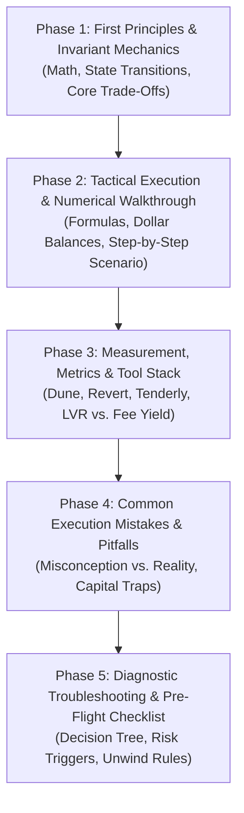

# LearningSEO Pedagogy Applied to DeFi Market Microstructure

This reference outlines how the educational philosophy of [LearningSEO.io](https://learningseo.io/) (created by Aleyda Solis) is translated into the editorial DNA of **LiquidityPools.app**.

---

## 1. The Core LearningSEO Philosophy

LearningSEO transformed technical SEO education by rejecting three prevalent industry vices:
1. **Shallow Listicle Content**: Abandoning high-level 500-word fluff pieces in favor of comprehensive, structured, step-by-step masterclasses.
2. **Abstract Theory Without Execution**: Grounding every concept in practical workflows, tools, templates, and audits.
3. **Unverified Generalizations**: Anchoring advice in real practitioner quotes, reproducible experiments, and transparent metrics.

For **LiquidityPools.app**, this translates directly into treating DeFi education as **quantitative financial engineering and operational risk management** rather than retail crypto enthusiasm.

---

## 2. The 5-Phase Pedagogical Architecture

Every guide must follow a predictable, cognitively progressive 5-phase structure:



### Phase 1: First Principles & Invariant Mechanics
- Open immediately with the fundamental constraint (no historical throat-clearing).
- Define the governing mathematical invariant ($x \cdot y = k$, $L$, $\sqrt{P}$, DLMM bin shift, or curve amplification $A$).
- Diagram the state transitions via a custom 3D isometric figure.

### Phase 2: Tactical Execution & Concrete Numerical Walkthrough
- Walk through an end-to-end capital deployment using realistic market numbers.
- Specify exact token pairs, fee tiers, tick bounds, and dollar amounts.
- Quantify entry capital, fee capture rate, impermanent divergence loss, and rebalance friction.

### Phase 3: Measurement, Metrics & Required Tool Stack
- Provide the exact onchain monitoring infrastructure needed to evaluate performance:
  - **Dune Analytics**: Custom dashboards for pool volume, tick depth, and LP concentration.
  - **Revert Finance / Aperture**: Net PnL, fee accrual vs. divergence loss, HODL benchmark comparison.
  - **EigenPhi / Zeromev**: MEV sandwich volume, toxic arbitrage percentage, and searcher extractable value.
  - **Tenderly / Foundry**: Simulation of swap routing, hook execution, and gas profiling.
  - **DeFiLlama**: TVL trends, pool fee-to-TVL ratios, and protocol-level liquidity incentives.

### Phase 4: Common Execution Mistakes & Misconceptions Analysis
- Inspired by LearningSEO's famous "Common Execution Mistakes To Avoid" pillar.
- Break down the 3–5 most lethal assumptions made by retail LPs (e.g., chasing nominal APY without subtracting LVR, over-rebalancing in high-gas regimes, neglecting tick density skew).
- Present these in a high-density Markdown comparison table.

### Phase 5: Diagnostic Troubleshooting & Pre-Flight Checklist
- Modeled after LearningSEO's "Why my page doesn't rank" diagnostic checklist.
- Provide a systematic diagnostic flowchart or decision tree:
  - *If fee income < 50% of expected $\to$ Audit toxic flow ratio on Dune.*
  - *If position crosses boundary $\to$ Evaluate whether realized volatility $\sigma$ has permanently shifted or is transient noise before rebalancing.*
- Conclude with a rigorous pre-flight checklist.

---

## 3. The "Editor's Note" Pattern

LearningSEO punctuates complex topics with real specialist perspectives, quoting named practitioners who actually said those things.

LiquidityPools.app has no named practitioners, so we never quote people. Instead a guide carries an unattributed **Editor's note** that turns the cited sources into a practical takeaway. Any figure in it must come from a source cited in the guide:

```markdown
> [!TIP]
> **Editor's note:**
> Annualising one day of fee yield overstates returns in volatile pairs, because much of that day's volume can come from arbitrage against stale pool prices. Compare the pool fee with realised volatility over the same window before trusting the headline APR (see the LVR research cited in this guide).
```

Editor's notes bridge the equations and onchain execution without inventing experience or statistics.
